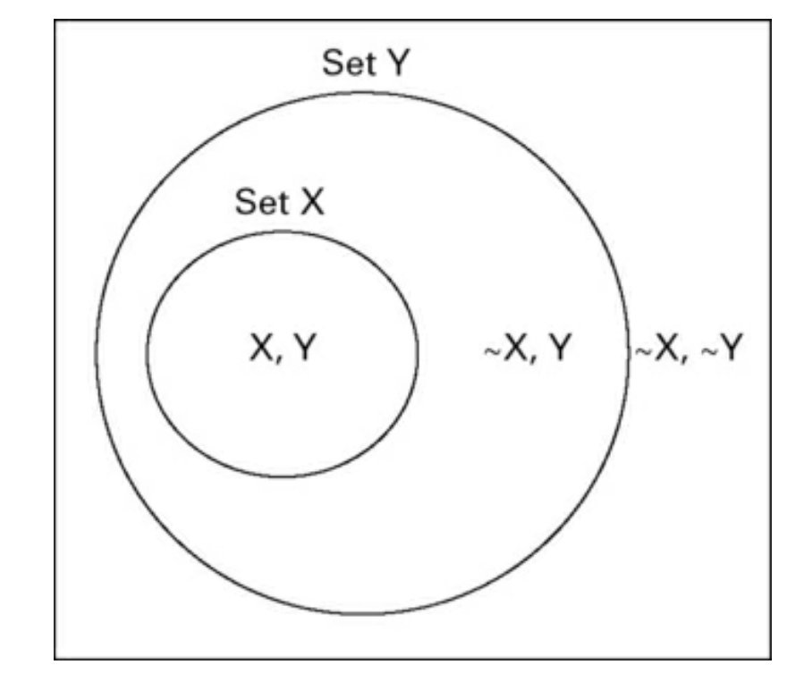
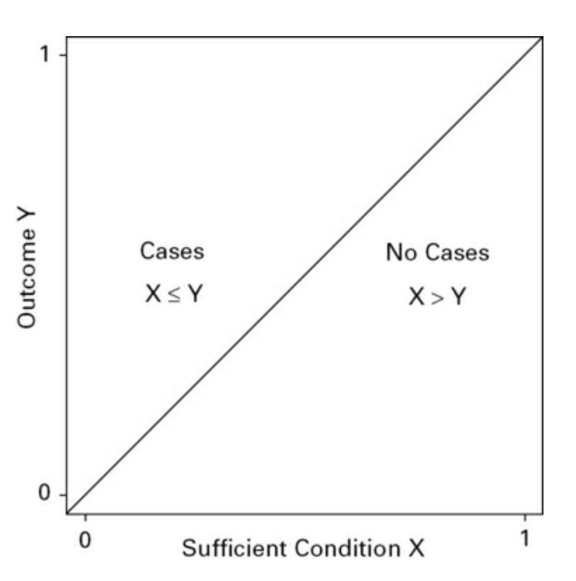

# Condiciones suficientes en QCA

El capítulo 3 del libro de @schneider2012_set recoge las condiciones de suficiencia y necesidad.

La condición de suficiencia indica que cuando se da una determinada condición X se produce el resultado Y, es decir:

> X → Y

O dicho de otra forma, una condición de tipo "if ___ then ___"

Por ejemplo, 

> si un país pertenece a la Unión Europea, entonces pertenece al conjunto de países democráticos.

Una condición suficiente no nos dice nada sobre lo que sucede con el conjunto negado ~ X

Por ejemplo, si un país no pertenece a la unión europea puede ser o puede no ser una democracia.

En lógica crisp, para que una condición pueda ser suficiente se tienen que producir los siguientes casos:

|       | X = 0                        |  X =  1 |
|-------|------------------------------|---------|
|Y = 1  | puede haber o no haber casos | n casos |
|Y = 0  | puede haber o no haber casos | 0 casos |

Como veíamos en las [operaciones booleanas](2003231138_operaciones_boleanas.md), la suficiencia implica la inclusión de X en Y, es decir, que X es un subconjunto del conjunto Y que a su vez es un subconjunto de todos los sets posibles.

## Combinaciones de condiciones y negaciones

Esta lógica general para una condición vale para combinaciones de distintas, con los operadores AND o NOT, es decir, podemos ver condiciones de suficiencia para A*B, para ~A, para ABC... y eso es lo que hacemos para ver qué condiciones explican el output. Todas aquellas combinaciones que generen condiciones suficientes nos ayudan a explicar cuando se produce el ouptut.

## En lógica fuzzy

En lógica fuzzy ya no tenemos el criterio tan definido como en crips, pero tenemos que seguir la regla de que:

> para que una condición sea suficiente, cada valor de X tiene que tener una puntuación **menor o igual que la puntuación en Y**, nunca mayor, porque eso indicaría que la puntuación de pertenecer a X es más alta que la puntuación de pertenecer a Y y por lo tanto ya no sería suficiente.

## Notas relacionadas

- [Index](_2003101705_index.md)
- [Los métodos set theoretic](2003212003_set_theoretic_methods.md)
- [Qué es el QCA](2003212024_qca_descripcion.md)
- [Qué es un set](2003221713_setdefinition_qca.md)
- [Cómo calibrar](2003221733_calibracion_sets.md)
- [Lógica booleana](2003231138_operaciones_boleanas.md)
- [Análisis de necesidad](2003241901_condicionnecesidadqca.md)
- [Complejidad causal: INUS Y SUIN](2003250705_causalcomplexity.md)
- [Tablas de la verdad](2003260827_qca_tabladelaverdad.md)
- [Minimización de la tabla de la verdad](2003261610_minimizacion_tabladelaverdad.md)
- [Consistencia de condiciones suficientes](2003280813_consistencia_qca.md)

--

Referencias:

Schneider, C. Q., & Wagemann, C. (2012). Set-theoretic methods for the social sciences: A guide to qualitative comparative analysis (C. Elman, J. Gerring, & J. Mahoney, eds.). Cambrigde: Cambridge University Press.

