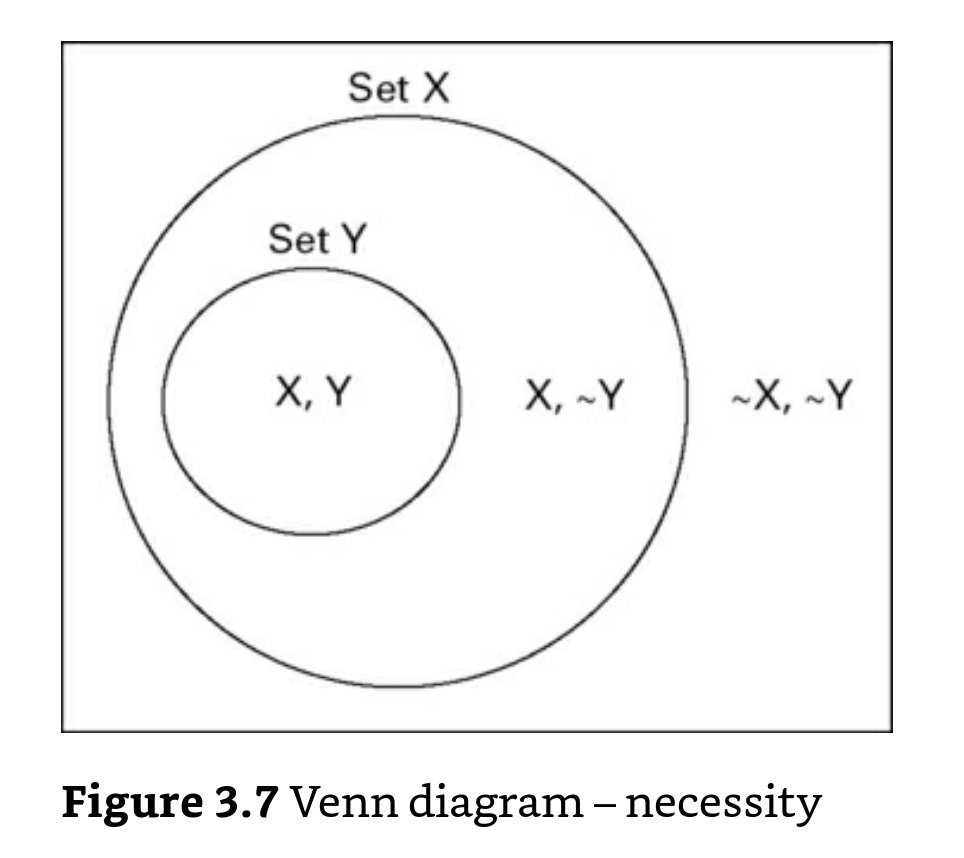

# Análisis de necesidad

El análisis de condiciones necesarias es complementario al de suficiencia.

Una condición X es necesaria para un resultado Y si se cumple X ← Y o, dicho de otra forma

 > Si se da Y, se da X.

 En ese sentido, Y, el outcome, es un **subconjunto de X**.

 También podemos decir que Y no se da en ausencia de X o que cuando se da Y, siempre se da X.

 Un ejemplo interesante que da @dusa2019_qca de cómo expresar las hipótesis sobre condiciones necesarias es comparar estas dos afirmaciones:

 - The higher the level of economic development, the more likely a country is a democracy -> Sería una hipótesis clásica que expresa una correlación
 
 - A minimum level of economic development is necessary for democracy -> Sería una hipótesis en la que el set "nivel básico de desarrollo económico" es una condición necesaria para el outcome "democracia".

 - En **crisp** para controlar la necesidad comprobamos los casos en los que Y = 1 y comprobamos que X = 1 (al contrario que en suficiencia, donde nos fijamos en los casos en los que X= 1 y comprobamos que Y = 1).

|       | X = 0                        |  X =  1                     |
|-------|------------------------------|-----------------------------|
|Y = 1  | 0 casos                      | n casos                     |
|Y = 0  | puede haber o no haber casos |puede haber o no haber casos |

 Expresado como conjuntos:

 - En **fuzzy** comprobamos que para todo X, **X >= Y** (al contrario que en suficiencia, donde para todo X, X<=Y). (por debajo de la diagonal en el gráfico)

En suficiencia, teníamos que comprobar además la suficiencia de las condiciones **AND** porque una condición individual puede no ser necesaria y la combinación sí. Sin embargo, en necesidad esto no tiene sentido, porque para que una combinación AND fuera necesaria, todas las condiciones individuales tendrían que serlo.

El análisis de necesidad siempre debe ir primero y configurarse en el proceso de simplificación para evitar [problemas del estándar análisis](2004020637_problemas_potenciales_QCA_extensiones.md)

Además, según es necesario tener en cuenta que una condición causal puede ser necesaria para la presencia de un set, además de para su ausencia (necesidad de controlar relevancia) [@@dusa2019_qca ]

## Notas relacionadas

- [Index](_2003101705_index.md)
- [Los métodos set theoretic](2003212003_set_theoretic_methods.md)
- [Qué es el QCA](2003212024_qca_descripcion.md)
- [Qué es un set](2003221713_setdefinition_qca.md)
- [Cómo calibrar](2003221733_calibracion_sets.md)
- [Lógica booleana](2003231138_operaciones_boleanas.md)
- [Análisis de suficiencia](2003241628_analisissuficiencia_qca.md)
- [Consistencia de condiciones suficientes](2003280813_consistencia_qca.md)
- [Cobertura de condiciones suficientes](2003280911_cobertura_solucionsuficiente.md)
- [Consistencia y cobertura de condiciones necesarias](2003290828_consistencia_cobertura_condiciones_necesarias.md)
- [Problemas y extensiones del Standard Analysis](2004020637_problemas_potenciales_QCA_extensiones.md)
- [Resumen de BBPP QCA](2004020654_resumen_etapas_bbpp_qca.md)

--

Referencias:

- Duşa, A. (2019). QCA with R: A comprehensive resource. In QCA with R: A Comprehensive Resource. https://doi.org/10.1007/9783319756684
- Schneider, C. Q., & Wagemann, C. (2012). Set-theoretic methods for the social sciences: A guide to qualitative comparative analysis (C. Elman, J. Gerring, & J. Mahoney, eds.). Cambrigde: Cambridge University Press.