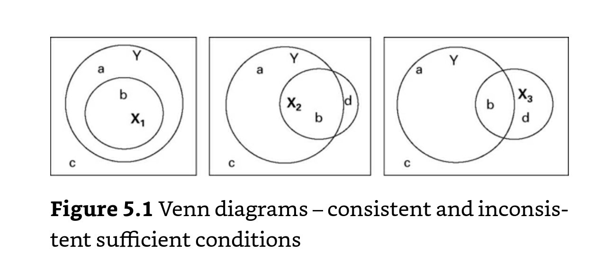

# Consistencia en las tablas de la verdad

Aunque en la teoría cada fila de la verdad solo puede llevar a un outcome, en la práctica, las tablas de las verdad tienen dos problemas:

- podemos tener ausencia de evidencia empírica para determinadas combinaciones de las condiciones
- podemos tener combinaciones de las condiciones (filas) con evidencia contradictoria: en algunos casos se produce el outcome y en otros no.

La **consistencia** es una medida empíricia que trata de medir y lidiar con estas **contradicciones**.

Es importante decir que la consistencia solo es una forma de lidiar con las contradicciones y que **debe ser la última**.

Según @schneider2012_set (capítulo 5), antes es necesario plantar soluciones desde la teoría que pueden ser de tres tipos:

1. Añadir una condición a la tabla de la verdad: los casos contradictorios pueden no serlo si se añade una condición más. El potencial problema es que multiplicamos el número de filas en la tabla.
2. Redefinir la población de interés: quizás los casos que son contradictorios no corresponden a la población si se define de forma más estricta (¡no confundir con cherry picking!! (aunque suena un poco parecido))
3. Reespecificar la definición o la operalización de las medidas del outcome o de las condiciones

Según @schneider2012_set (pag. 122):

> Only if inconsistent rows still exist after these time- and energy-consuming counter-measures, should one resort to those strateges that handle such rows during the process of logical minimization.

Estas tres soluciones son las que se indican según la cita de Ragin (2000):

> "going back and forth between ideas and evidence"

Si estas tres soluciones no funcionan, nos encontramos con una tabla de la verdad en la que algunas filas tienen evidencia contradictoria. Las opciones son:

- Excluir todas las contradictorias: nuestra solución tendría solo subsets perfectos
- Incluir todas las filas contradictorias: nuestra solución tendría todos los subsets que potencialmente podrían generar el outcome
- Utilizar algún algoritmo de resolución de filas >> No recomendado
- Utilizar **medidas de consistencia** para basar la toma de decisiones >> recomendado

La consistencia mide en qué medida una condición se desvía de una perfecta relación de set.

> En qué medida una configuración es consistente con la afirmación de ser una condición suficiente para el outcome.

En la figura se muestra una condición totalmente consistente (X1) y dos con distintos grado de inconsistencia (X2 y X3)

La consistencia de las condiciones suficientes mide el porcentaje en el que se cumple el outcome del total de **X**. 

En crisp sets se expresa como:

> Consistencia de X como una condición suficiente de Y = (Número de casos X = 1, Y = 1)/(Número de casos X= 1)

En fuzzy sets se expresa como:

> Consistencia de X como una condición suficiente de Y = sum_i(min(X_i, Yi_))/(sum(X_i))

La consistencia mínima que debemos exigir para considerar una condición suficiente depende de las bases teóricas (más alta cuanto mayores son las bases teóricas), del número de casos (más alta cuanto menos casos) o de la confianza en el proceso de calibración (más alta).

La consistencia se basa en la suficiencia de una condición lo que implica que podemos hablar de:

- consistencia de una fila: se denomina también **raw consistency**
- consistencia de la solución total: se denomina **solution consistency**

## Notas relacionadas

- [Index](_2003101705_index.md)
- [Los métodos set theoretic](2003212003_set_theoretic_methods.md)
- [Qué es el QCA](2003212024_qca_descripcion.md)
- [Qué es un set](2003221713_setdefinition_qca.md)
- [Cómo calibrar](2003221733_calibracion_sets.md)
- [Lógica booleana](2003231138_operaciones_boleanas.md)
- [Análisis de necesidad](2003241901_condicionnecesidadqca.md)
- [Análisis de suficiencia](2003241628_analisissuficiencia_qca.md)
- [Complejidad causal: INUS Y SUIN](2003250705_causalcomplexity.md)
- [Tablas de la verdad](2003261610_minimizacion_tabladelaverdad.md)
- [Minimización de las tablas de la verdad](2003261610_minimizacion_tabladelaverdad.md)
- [Cobertura de condiciones suficientes](2003280911_covertura_solucionsuficiente.md)