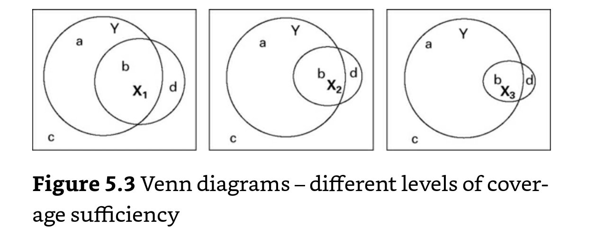

# Cobertura en tablas de verdad: cobertura de condiciones suficientes

La cobertura trata de explicar qué parte del outcome Y queda explicada por la **condición suficiente** Y.

En la figura se refleja este concepto:

Las tres condiciones tienen un pequeño grado de inconsistencia, pero la cobertura de X1 es mucho mayor, la de X2 es intermedia y la de X3 es muy baja.

La cobertura es un concepto relativo a la proporción de Y, por lo que en el cálculo, en el denominador de se incluye la Y.

En crisp sets se expresa como:

> Cobertura de X como una condición suficiente de Y = (Número de casos X = 1, Y = 1)/(Número de casos **Y= 1**)

En fuzzy sets se expresa como:

> Cobertura de X como una condición suficiente de Y = sum_i(min(X_i, Yi_))/(sum(**Y_i**))

Es importante señalar, que:

> la cobertura **solo tiene sentido para aquellas condiciones que son suficientes.**

Como señala @schneider2012_set en la página 133, no tiene ningún sentido calcular e interpretar la cobertura de una condición que no es suficiente.

## Tipos de cobertura

Como hemos dicho, el concepto de [equifinalidad](2003250705_causalcomplexity.md) hace que distintas combinaciones lleven al outcome y tiene sentido calcular la cobertura de estas distintas posibilidades.

Así, primero tenemos que calcular cuanto cubren cada uno de las combinaciones, pero también cuanto se cubre de forma única por cada uno de ellos, dado que se pueden superponer. Se ve mejor en la figura:

La cobertura bruta para las condiciones X1, X2 y X3 es el porcentaje que explican, el tamaño del círculo mientras que la cobertura única sería igual para el caso de X2, pero en el caso de X1 y X3 habría que restarle a la cobertura cruda para X1 y X3 el área en el que estas se superponen (área II).

Así:

> Raw coverage o cobertura cruda es la proporción del outcome que está explicada por una condición suficiente.
> Unique coverage o cobertura única es la proporción del outcome que está explicada, de forma exclusiva, por una condición suficiente.
> Solution coverage o cobertura de la solución es la proporción del outcome que está explicada por el conjunto de la solución.

Para calcular las coberturas únicas se resta de la cobertura de la solución la cobertura del resto de condiciones.

Así, en la figura, la cobertura única de X3 (area III) es la cobertura de la solución (áreas I, II, III y IV) menos la cobertura bruta de las otras dos condiciones (áreas I, II y IV).

## Notas relacionadas

- [Index](_2003101705_index.md)
- [Los métodos set theoretic](2003212003_set_theoretic_methods.md)
- [Qué es el QCA](2003212024_qca_descripcion.md)
- [Qué es un set](2003221713_setdefinition_qca.md)
- [Cómo calibrar](2003221733_calibracion_sets.md)
- [Lógica booleana](2003231138_operaciones_boleanas.md)
- [Análisis de necesidad](2003241901_condicionnecesidadqca.md)
- [Análisis de suficiencia](2003241628_analisissuficiencia_qca.md)
- [Complejidad causal: INUS Y SUIN](2003250705_causalcomplexity.md)
- [Tablas de la verdad](2003261610_minimizacion_tabladelaverdad.md)
- [Minimización de las tablas de la verdad](2003261610_minimizacion_tabladelaverdad.md)
- [Consistencia de condiciones suficientes](2003280813_consistencia_qca.md)