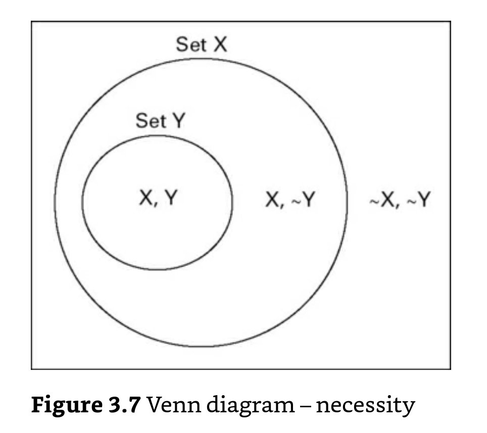

# Consistencia y cobertura en condiciones necesarias

Las propiedades de consistencia y cobertura se interpretan de forma distinta en condiciones necesarias.

## Consistencia de condiciones necesarias

Si X es necesaria para Y, X es un superset de Y. Y así:

> el cálculo de la consistencia de una condición necesaria es equivalente al de la cobertura de una condición suficiente:

> Consistencia de X como una condición necesaria de Y = (Número de casos X = 1, Y = 1)/(Número de casos **Y= 1**)

> Consistencia de X como una condición necesaria de Y = sum_i(min(X_i, Yi_))/(sum(**Y_i**))

Para que una condición necesaria sea suficiente, el **umbral de consistencia debe ser muy alto, más de 0.9** (@schneider2012_set página 142)

## Cobertura de condiciones necesarias

Solo se puede calcular la **cobertura de las condiciones que son consistentes**, no tiene sentido en otro caso.

La interpretación de la cobertura de condiciones necesarias es muy distinta, ya que X es un superset de Y, no tiene sentido interpretarlo como la proporción de Y explicada (sería el 100%).

> el cálculo de la cobertuta de una condición necesaria es equivalente al de la consistencia de una condición suficiente:

> Consistencia de X como una condición necesaria de Y = (Número de casos X = 1, Y = 1)/(Número de casos **X= 1**)

> Consistencia de X como una condición necesaria de Y = sum_i(min(X_i, Yi_))/(sum(**X_i**))

En este caso se interpreta como, **cómo de pequeño es Y en relación con X**. 

Si **X e Y** son de tamaños similares, la cobertura es alta. Si X es muy grande en relación con Y la cobertura es baja. 

En este sentido, sería mejor hablar de **relevancia** o de **no trivialidad**.

> un ejemplo, una condición necesaria para Y = ser un cliente satisfecho es X = ser persona, ahora bien, sería una condición trivial por completo.

> Otro ejemplo, Y = los discursos que dan en el parlamento, los parlamentarios X = nacidos en el país. Esta condición no presentaría una consistencia del 100% porque puede haber algún parlamentario extranjero, pero sería igualmente trivial.
 
 ## Notas relacionadas

- [Index](_2003101705_index.md)
- [Los métodos set theoretic](2003212003_set_theoretic_methods.md)
- [Qué es el QCA](2003212024_qca_descripcion.md)
- [Qué es un set](2003221713_setdefinition_qca.md)
- [Cómo calibrar](2003221733_calibracion_sets.md)
- [Lógica booleana](2003231138_operaciones_boleanas.md)
- [Análisis de necesidad](2003241901_condicionnecesidadqca.md)
- [Análisis de suficiencia](2003241628_analisissuficiencia_qca.md)
- [Complejidad causal: INUS Y SUIN](2003250705_causalcomplexity.md)
- [Tablas de la verdad](2003261610_minimizacion_tabladelaverdad.md)
- [Minimización de las tablas de la verdad](2003261610_minimizacion_tabladelaverdad.md)
- [Consistencia de condiciones suficientes](2003280813_consistencia_qca.md)
- [Cobertura de condiciones suficientes](2003280911_cobertura_solucionsuficiente.md)

--

Referencias:

Schneider, C. Q., & Wagemann, C. (2012). Set-theoretic methods for the social sciences: A guide to qualitative comparative analysis (C. Elman, J. Gerring, & J. Mahoney, eds.). Cambrigde: Cambridge University Press.