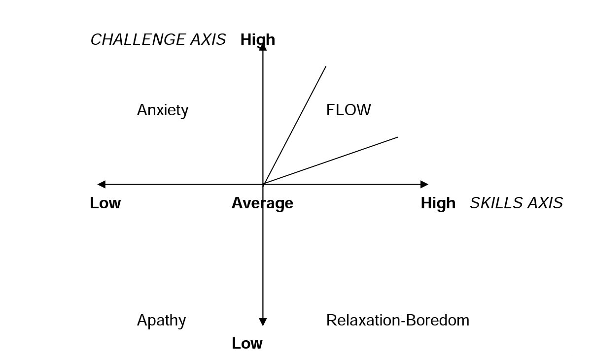

# La medición del estado de flow

La escala más popular para medir el estado de flow es una escala registrada con copyright, con un coste de utilización de unos 150€ cada 50 encuestas.

El manual de utilización también es de pago, aunque tengo una copia prestada por Xiaowei: [flow scale manual](2003291853_flow_manual.pdf)

Estas escalas están basadas en los trabajos de Csikszentmihalyi (1975), Jackson, (1993) y otros de los mismos autores y se contextualiza el flow en el ámbito de las skills y el challenge:

Hay nueve dimensiones de flow:

- balance entre reto y habilidad
- unión de conciencia y acción, absorción
- objetivos claros
- feedback no ambiguo: sabes cómo estás haciendo las cosas
- concentración total en la tarea
- sentido de control
- perdida de autoconciencia
- transformación de tiempo
- experiencia autotélica: que proporciona recompensa intrínseca, por sí misma

## Las escalas de Jackson

|Ámbito                                      | Tipo            | ítems    | Acrónimo                                 |
|--------------------------------------------|-----------------|----------|------------------------------------------|
|Experiencia concreta de flow                |Multidimensional |   36     |  FSS-2  Flow State Scale-2               |
|Tendencia general al flow en una actividad  |Multidimensional |   36     |  DFS-2  Disposicional Flow Scale 2       |
|Experiencia concreta                        |Unidimensional   |    9     |  Short  SFF-2                            |
|Experiencia global                          |Unidimensional   |    9     |  Short  DFS-2                            |
|Sentimiento durante estado de flow          |Unidimensional   |   10     |  Core                                    |

Otras escalas son las derivadas específicamente para algunas actividades como el yoga o actividades físicas.

## Short Flow State

| Short FSS-2                                                          | Short DFS-2                                                        |
|----------------------------------------------------------------------|--------------------------------------------------------------------|
| I felt I was competent enough to meet the demands of the situation   |I feel I am competent enough to meet the demands of the situation   |
| I did things spontaneously and automatically without having to think |I do things spontaneously and automatically without having to think |
|I had a strong sense of what I wanted to do                           |I have a strong sense of what I want to do                          |
|I had a good idea about how well I was doing while I was involved in the task/activity | I have a good idea about how well I am doing while I am involved in the task/activity |
|I was completely focused on the task at hand                          |  I am completely focused on the task at hand                       |
|I had a feeling of total control over what I was doing                | I have a feeling of total control over what I am doing             |
|I was not worried about what others may have been thinking of me      | I am not worried about what others may be thinking of me           |
|The way time passed seemed to be different from normal                | The way time passes seems to be different from normal              |
| I found the experience extremely rewarding                           | The experience is extremely rewarding                              |

## Core flow state

| Core-FSS                                      | Core-DFS                                                |
|-----------------------------------------------|---------------------------------------------------------|
|I was ‘totally involved’                       | I am ‘totally involved’                                 |
| It felt like ‘everything clicked’’            | It feels like ‘everything clicks’                       |
| I was ‘tuned in’ to what I was doing          | I am ‘tuned in’ to what I am doing                      |
| I was ‘in the zone’                           | I am ‘in the zone’                                      |
| I felt ‘in control’                           | I feel ‘in control’                                     |
| I was ‘switched on’                           | I am ‘switched on’                                      |
| It felt like I was ‘in the flow’ of things    | It feels like I am ‘in the flow’ of things              |
| It felt like ‘nothing else mattered’’         | It feels like ‘nothing else matters’                    |
|  I was ‘in the groove’                        | I am ‘in the groove’                                    |
| I was ‘totally focused’ on what I was doing   | I am ‘totally focused’ on what I am doing               |

## Example items long FSS and DFS

### 1. Challenge-Skill Balance  Q1+Q10+Q19+Q28
| Core-FSS                                                                        | Core-DFS                                           |
|---------------------------------------------------------------------------------|----------------------------------------------------|
| I was challenged, but I believed my skills would allow me to meet the challenge | I am challenged, but I believe my skills will allow me to meet the challenge            |
| My abilities matched the high challenge of the situation                        |  My abilities match the challenge of what I am doing               |
| I felt I was competent enough to meet the high demands of the situation         |  I feel I am competent enough to meet the demands of the situation |
| The challenge and my skills were at an equally high level                       |  The challenge and my skills are at an equally high level          |

## Notas relacionadas

- [Index](_2003101705_index.md)
- [La compra por impulso online, teorías que la explican](2003190944_compra_por_impulso_online.md)
- [Desarrollo de teorías a partir de grounded theory](2003191208_creacion_modelo_grounded_theory.md)

