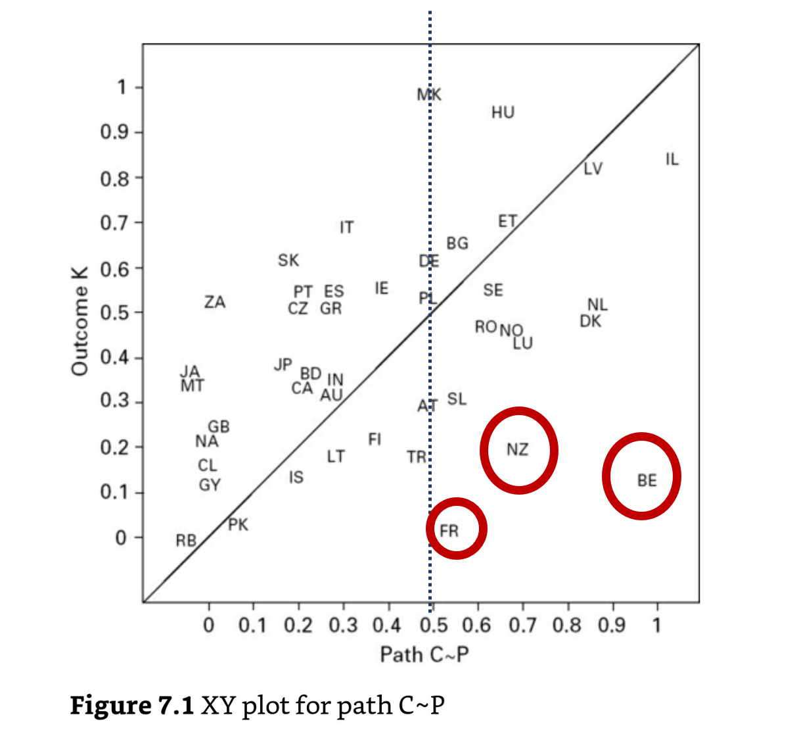
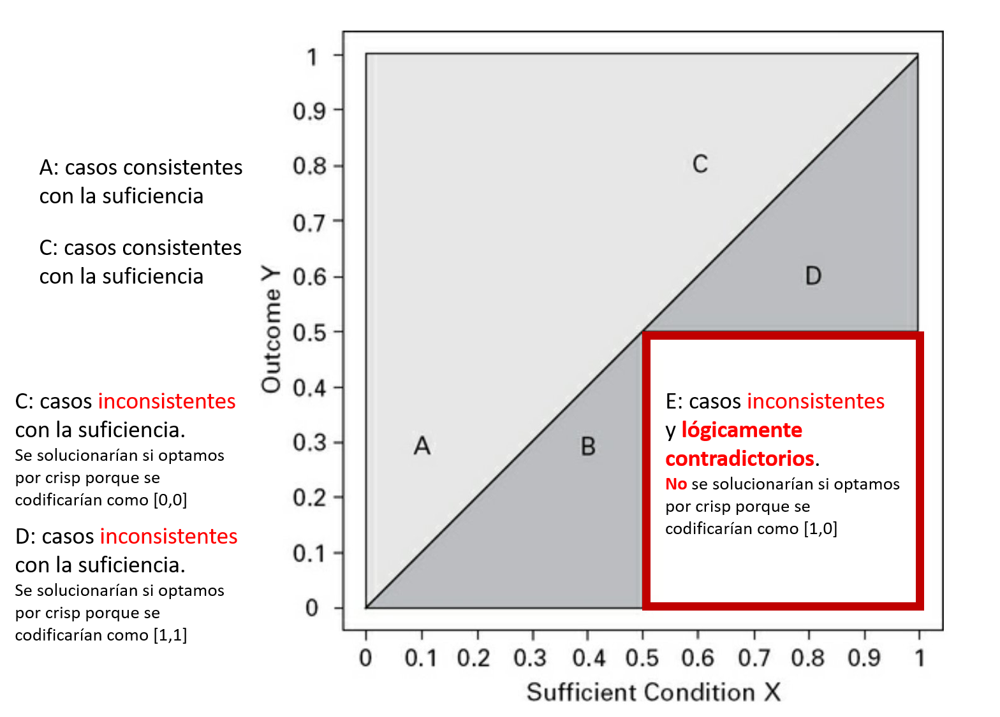

# Resumen del algoritmo de la tabla de la verdad

@schneider2012_set en el Capítulo 7 resumen los pasos y cuestiones relacionadas con el algoritmo de la tabla de la verdad y las cuestiones relativas a la **suficiencia** que se han visto en los capítulos 4, 5 y 6.

Los pasos en el algoritmo son:

**1.-** Conversión de la matriz de datos en la tabla de la verdad: Es más trivial para el caso de crisp sets, e incluye la asignación a la única combinación que supera el umbral del 0.5 para los fuzzy sets.

**2.-** Atribución de un outcome a cada fila en la tabla de la verdad: aquí entran en juego las reglas de consistencia: Aquí se detectan los logical reminders, aquellas filas para las que no hay evidencia suficiente (por ejemplo, si ningún caso supera el umbral 0.5). Para el resto de filas, tenemos que decidir si son suficientemente consistentes, si **la pertenencia al caso es igual o menor a la pertenencia al outcome**.  

Es importante que no nos fijemos solo en el valor de la consistencia como tal, aunque **se suele utilizar el umbral de 0.8**, sino si hay casos que son:

> Logical contradictions: Son casos que pertenecen al conjunto X pero no pertenecen al outcome Y y por tanto contradicen directamente la suficiencia de la condición. La puntuación de pertenencia a la fila sería mayor que 0.5 y la de pertenencia al outcome sería menor de 0.5.

Esto es importante, porque si establecemos esa condición como suficiente, tendremos evidencia en nuestros datos que directamente la descarta. No es lo mismo un valor de consistencia bajo porque algún caso tiene pertenecia a X = 0.7 y pertenecia a Y = 0.6 que pertenencia a X = 0.6 y a Y = 0.4

3.- Minimización lógica de la tabla: aquí entra en juego el procedimiento de Standard Analysis y los supuestos sobre los *logical reminders*.

Una vez que tenemos seleccionadas las filas con consistencia adecuada (e.g. aquellos con valor superior a 0.8 y con pocos o ningún caso lógicamente inconsistente), minimizamos para obtener la solución, tomando una decisión sobre los **recordatorios lógicos**, aquellos sobre los que hay ausencia de información. Si somos consrevadores, suponemos que ninguno lleva al outcome y tenemos la solución compleja. Si queremos simplificar al máximo, suponemos que todos podrían generar el outcome y tenemos la solución parsimoniosa. Si aplicamos el Standard Analysis tenemos la solución intermedia.

 ## Notas relacionadas

- [Index](_2003101705_index.md)
- [Los métodos set theoretic](2003212003_set_theoretic_methods.md)
- [Qué es el QCA](2003212024_qca_descripcion.md)
- [Qué es un set](2003221713_setdefinition_qca.md)
- [Cómo calibrar](2003221733_calibracion_sets.md)
- [Lógica booleana](2003231138_operaciones_boleanas.md)
- [Análisis de necesidad](2003241901_condicionnecesidadqca.md)
- [Análisis de suficiencia](2003241628_analisissuficiencia_qca.md)
- [Complejidad causal: INUS Y SUIN](2003250705_causalcomplexity.md)
- [Tablas de la verdad](2003261610_minimizacion_tabladelaverdad.md)
- [Minimización de las tablas de la verdad](2003261610_minimizacion_tabladelaverdad.md)
- [Consistencia de condiciones suficientes](2003280813_consistencia_qca.md)
- [Cobertura de condiciones suficientes](2003280911_cobertura_solucionsuficiente.md)
- [Suficiencia y cobertura de condiciones necesarias](2003290828_consistencia_cobertura_condiciones_necesarias.md)
- [Diversidad limitada](2003300812_diversidad_limitada_qca.md)

--

Referencias:

Schneider, C. Q., & Wagemann, C. (2012). Set-theoretic methods for the social sciences: A guide to qualitative comparative analysis (C. Elman, J. Gerring, & J. Mahoney, eds.). Cambrigde: Cambridge University Press.